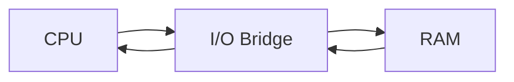
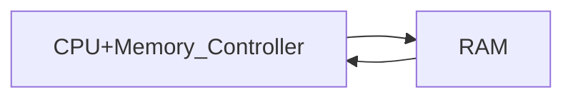

---
{"dg-publish":true,"permalink":"/Computer_Science/Memory_Hierarchy/CPU-메모리 상호작용(옛날 vs 최근)/","noteIcon":"","created":"2025-08-13T09:28:02.761+09:00","updated":"2025-08-18T01:04:50.156+09:00"}
---

- 최근 CPU는 **메모리 컨트롤러를 CPU 내부에 통합**  ➡ 메모리와 직접 연결

**옛날 방식**

**최근 방식**

- CPU 내부에 메모리 컨트롤러를 통합 시킴 ➡ **메모리 접근 속도 향상** 
- I/O 연결 책임은 칩셋이 책임짐

