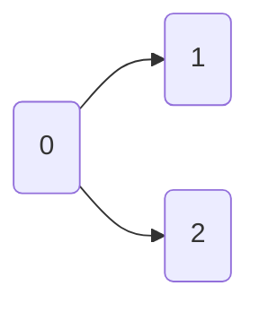

---
{"dg-publish":true,"permalink":"/DevStudy/Argorithm/Graph, BFS/개념/위상 정렬 개념/","noteIcon":"","created":"2025-12-03T14:52:52.147+09:00","updated":"2025-12-13T09:26:26.092+09:00"}
---


> 참고 링크 : 동빈나 - 위상정렬

### 개념 및 특징 

#### 1. 개념 
- **순서가 정해져 있는 작업을 차례로 수행해야 할 때** 그 순서를 결정해주기 위해 사용하는 알고리즘 
- **시간 복잡도** : O(정점 개수 + 간선 개수)  ➡ 매우 빠름 

#### 2. 특징 

>[!tip] (1) **그래프의 흐름**이 있고!!! (2) **다양한 조건들이 얽혀**있을 때  (3) 각 노드를 **일렬로 나열**할 수 있도록 하는 것 

1. **방향성 그래프** 
2. **비순환 그래프** ⭐
	- **사이클이 있다면 위상 정렬이 불가능**하다💢
	- **이유**
		- 가령, A ➡ B ➡ C ➡ A 이런 사이클이라면 순서를 정할 수 없다. 
		- ✔**위상 정렬은 진입차수가 0인 노드를 먼저 처리하고 간선을 제거하며 다음 노드를 찾는데**, 이런 사이클이 있을 경우 모든 노드의 진입차수가 절대 0이 되지 않는다.
		- 이로 인해, 큐에 들어갈 노드가 없어지고, 정렬이 끝내기 전에 멈춘다.

3. **선행 조건** 
4. **답이 여러 개가 존재**할 수 있다.
	- 여러 개의 **진입차수가 0인 노드가 동시에 존재**하는 경우 ➡ 어떤 노드를 먼저 처리하느냐에 따라 위상 정렬 결과가 달라짐 

#### 3. 활용 사례 

| 주제       | 설명                                       |
| -------- | ---------------------------------------- |
| 컴파일러     | 소스 코드의 의존성 관계를 분석하여 **컴파일 순서를 결정**할 때 사용 |
| 작업 스케쥴링  | 작업 간 선행 조건이 존재할 수 있는데 그것을 참고하여 **순서 결정** |
| 수업 선수 과목 | **어떤 순서로 수업을 들어야** 하는지 결정하는 데 활용         |


### 위상 정렬 방법(순서) - 큐 방식 
> 위상 정렬에서 사용하는 알고리즘
> 1. DFS 기반 (스택 이용)
> 2. 큐 기반 (BFS) 多

#### 1. 방법 (글)
>[!EXAMPLE] 참고 용어 : 진입 차수
>- 노드 `v`로 **들어오는 간선의 개수**를 의미 
>- 특정 노드로 오기 위한 조건 

1. 진입차수가 0인 정점을 큐에 삽입 
2. 큐에서 원소를 꺼내 연결된 모든 간선을 제거 
3. 간선 제거 후 진입차수가 0이 된 정점을 큐에 삽입
4. 이 과정을 계속 반복 

>[!WARNING] 사이클 검사
>- 만약, **모든 원소 방문 전에 큐가 빈다면 사이클이 존재** 💢
>- 모든 원소 방문했다면 큐에서 꺼낸 순서가 위상 정렬의 결과 
>- ✅ 정상 ➡  (위상 정렬 결과 리스트의 원소 수 = 정점의 개수)

#### 2. 코드 - 큐 방법 
```python
from collections import deque
def topological_sort(graph: dict, num_vertices: int):
  '''
  Args:
    graph : 인접 리스트 형태의 딕셔너리 (key: 정점 번호, value 간선)
      ex. {0: [1, 2], 1: [3], 2: [3], 3:[]}
    num_vertices : 그래프의 전체 정점 개수
  '''

  # 1. 진입 차수(in-degree) 계산
  in_degree = [0] * num_vertices
  for u in graph:
    for v in graph[u]:
      in_degree[v] += 1
      
  # 2. 진입 차수가 0인 정점들을 큐에 삽입
  dq = deque()
  for i in range(num_vertices):
    if in_degree[i] == 0:
      dq.append(i)

  # 위상 정렬 결과 리스트
  result = []
  while dq:
    u = dq.popleft() # 하나씩 pop
    result.append(u) # 결과 리스트에 추가

    # 3. u에서 나가는 간선에 연결된 정점들의 진입 차수 감소
    for v in graph[u]:
      in_degree[v] -= 1
      if in_degree[v] == 0:
        dq.append(v)
  # 사이클 검사 : 모든 노드 방문 시 위상 정렬된 것
  if len(result) == num_vertices:
    return result
  else:
    return None  # or []
```

> 나중에 하기 




`graph[0]` = {1, 2}


