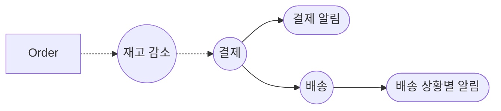
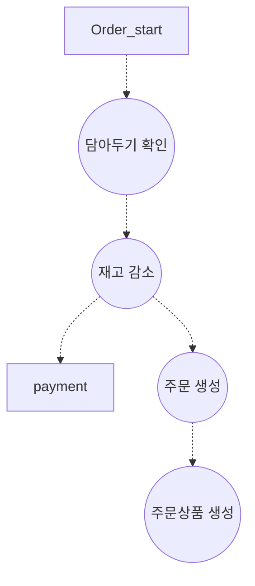
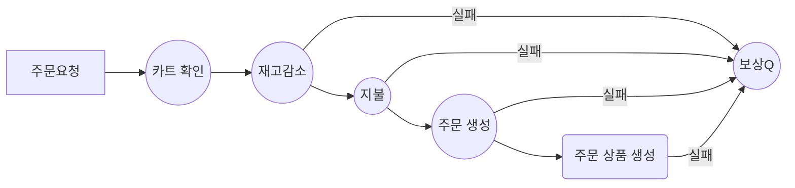
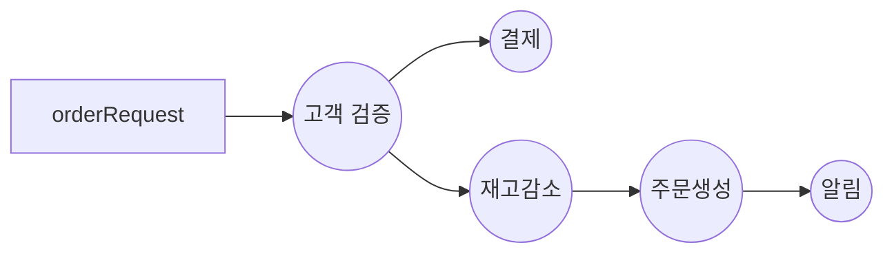
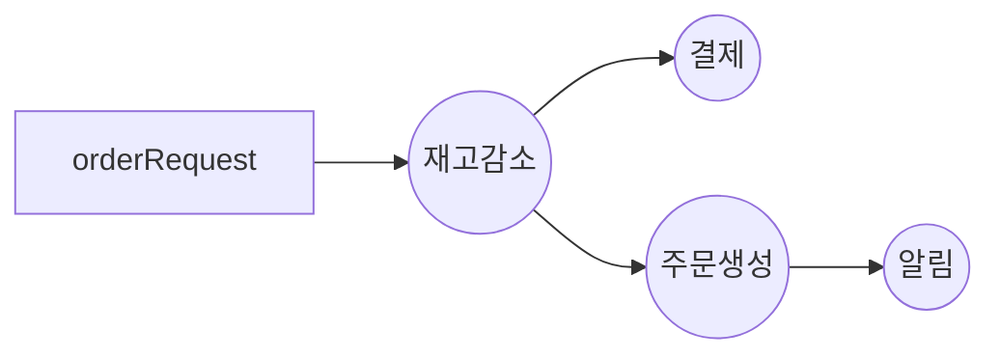
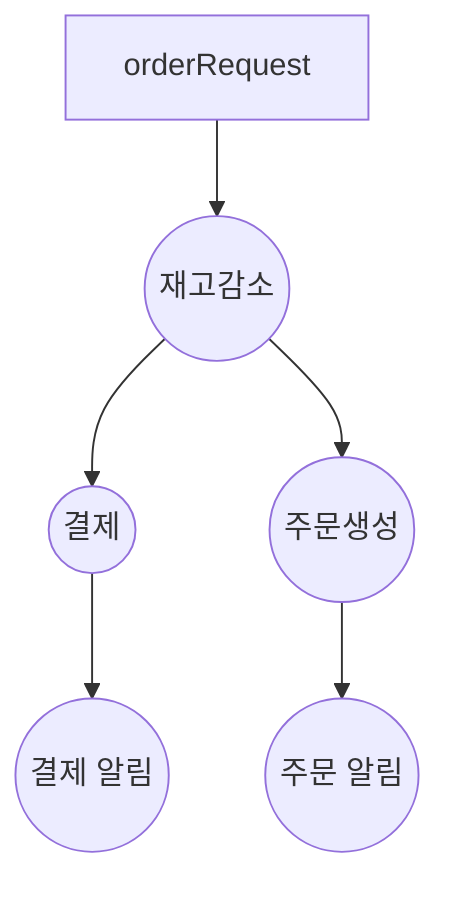
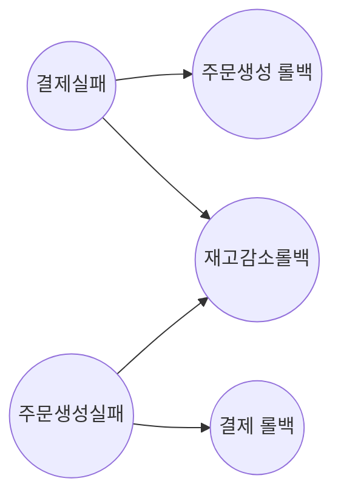
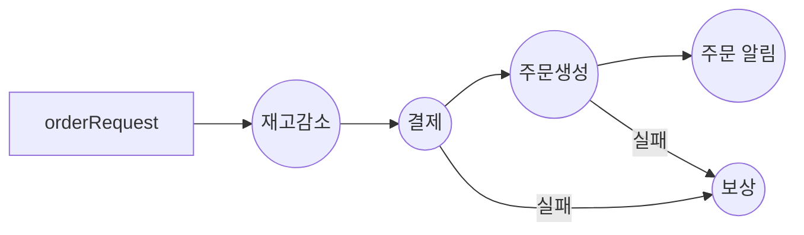

---
{"dg-publish":true,"permalink":"/DevStudy/Backend/RM/rabbit-pay/도메인 요구사항 및 DDL/","noteIcon":"","created":"2025-12-03T14:52:50.170+09:00","updated":"2025-12-13T10:21:21.203+09:00"}
---

### 0.1.  요구사항 분석 

- 회원 기능 
	- 회원 등록
	- 회원 조회 
	  
- 주문 기능 
	- 상품 주문 
	- 주문 내역 조회 
	- 주문 취소 
	  
- 상품 기능 
	- 상품 등록
	- 상품 조회
	- 상품 수정 
	  
- 결제 기능 
	- 결제 

### 0.2.  모델링 

회원 (Customer)
- id
- name
- password 
- Address 

주문 (Order)
- id 
- customer_id(fk)
- status(created, paid, shipped, cancelled)

상품(Product)B
- id 
- name
- price 
- stockQuantity

cart 
- cart_id 
- customer_id
- created_at
- updated_at

cart_Item
- cart_item_id
- cart_id
- product_id
- quantity
- added_at

OrderProduct 
- id
- order_id (fk)
- product_id(fk)
- quantity ???
- orderPrice 

Payment 
- id 
- order_id (fk)
- paid_at 
- Status (SUCCESS, FAILED, PROGRESS)
- Method(NAVER, KAKAO)
- amount 

Address
- id 
- customer_id
- 

### 0.3.  주문 기능 흐름 

**0619 시도 1** 

**0619 시도 2** 

주문생성 : 고객검증 + 주문 생성 
문제 주문생성성 시 product가 필요한데 재고감소에서 조회하고 한 번 더 조회하는 문제 

0619 시도 3 

근데 이렇게 하면 시간 불일치 문제 발생해서 고려할게 많아진다.
간단하게 아래처럼 하자 

롤백 시 필요한거 
1. 재고감소 롤백 시 
	- quantity
	- productId
2. 결제 롤백 시 
	- customerId
	- totalAmount 
3. 주문생성 롤백 시 
	- OrderId <<< Only One ❗
	- 하나만 있으면 된다. 왜냐면 Cascade걸어놨기 때문 

redis에 담을 것 
KEY = orderUUID 
Value
- quantity
- productId
- customerId
- totalAmount 
- OrderId

실패별 보상 매트릭스

| 실패 단계 | 재고 롤백 | 결제 롤백 | 주문 롤백 |
| ----- | ----- | ----- | ----- |
| 재고 감소 | ❌     | ❌     | ❌     |
| 결제    | ✅     | ❌     | ❌     |
| 주문 생성 | ✅     | ✅     | ❌     |

### 0.4.  각 기능 별 요구사항 심화 

#### 0.4.1.  카트

1. 담아두기 (orderItem)
	- user의 카트 없으면 생성 
	- user의 카트 있으면 기존 카트에 추가 
	  
2. 

#### 0.4.2.  배송 

품목별 배송 조회 
- 주문 전체가 아닌, 품목별로 배송 스케줄·상태가 달라지는 경우
- **order_product** 테이블과 1:1 (혹은 1:N) 으로 **delivery** 연결
- 이때 `order_product_delivery` 같은 중간 테이블을 별도로 두는 것이 명확

https://jki09871.tistory.com/64

