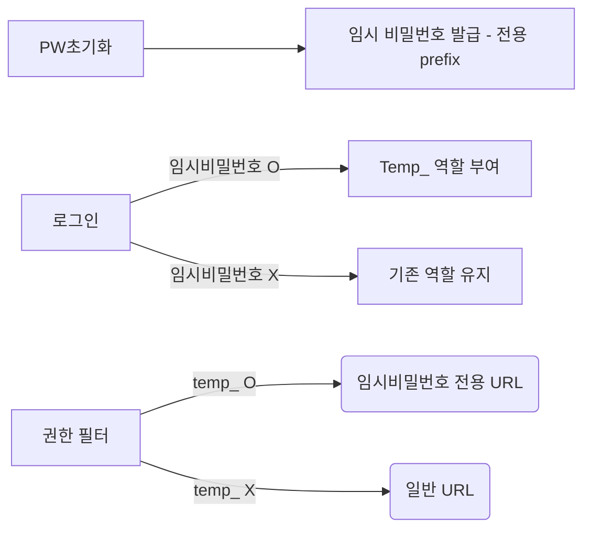

---
{"dg-publish":true,"permalink":"/DevStudy/Backend/Spring/임시 비밀번호 + 만료 + 강제 변경 로직 구현해보기/","noteIcon":"","created":"2025-12-03T14:52:47.781+09:00","updated":"2025-12-09T17:19:46.927+09:00"}
---

#### 요구 사항 정리 
> 비밀번호 초기화 시 

1. 임시 비밀번호를 해당 User의 이메일로 발급 
2. 임시 비밀번호는 만료 시간을 가진다.
3. 임시 비밀번호로 로그인 시, 새 비밀번호로 변경 必

### 고민 

1번은 간단하게 해결했다.
우선, 임시 비밀번호가 만료 시간을 갖게 하기 

---
#### 만료 시간 방법 1. Redis 이용

redis는 만료 시간을 준다.

임시 비밀번호 발급 
1. DB의 비밀번호는???
2. Redis에 저장
3. 만약 DB저장 시 시간이 지남

>Key Point : 임시 비밀번호를 만들어도 DB에 있는 비밀번호는 그대로 해야 하는가?

✅ DB 비밀번호 그대로일 경우 
- 간단하게 Redis 확인하는 로직 

❌DB 비밀번호를 바꿔야 할 경우 
- DB에 저장된 비번이랑 

