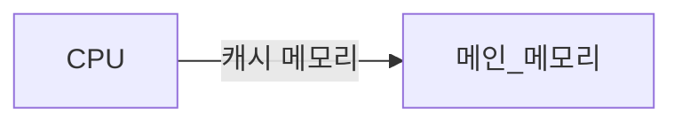

---
{"dg-publish":true,"permalink":"/os/computer-system/week01/1-6/","noteIcon":"","created":"2025-07-13T09:22:05.748+09:00","updated":"2025-07-13T20:56:51.978+09:00"}
---

--- 
#### 저장장치 계층 구조란 ❓

- 컴퓨터 시스템 내에서 사용되는 **다양한 저장 장치들을 단계별로 조직화**한 것 
- **층의 기준** : CPU에 얼마나 가까운가를 기준 
- 위 층 : 매우 빠름 But 비싸고 용량 작음 ex. SRAM, CPU 레지스터(Regs)
- 아래 층 : 용량 크고 매우 저렴 But 느림  ex. HDD 

>[!tip] "속도-용량-비용" 전부를 만족하는 저장장치는 없다. 

--- 
### CPU 레지스터 (Regs)
#CPU코어내부

- CPU 코어 내부에 있는 저장장치
- 역할 : CPU가 **현재 처리 중인 데이터나 주소, 중간 결과 등을 임시로 저장** 
- 속도가 매우 빠르다.
- 가장 비싸다 

--- 
### 캐시 메모리  (L1, L2, L3)

#### 개념 

- CPU - 메인메모리 **사이에 위치** 
- **SRAM 기반**의 저장 장치이다.

>[!tip] SRAM (Static RAM)
>- 시간이 지나도 데이터가 사라지지 않는다. ⭐(Unlike DRAM)
>- 이로 인해, 데이터 재활성화가 필요 없다. 
>- 단점 : 비싸고, 소비 전력 크다 
>- 따라서 진짜 필요한 캐시만 저장하는 것이 좋다ㅍ

#### 종류별 

1. **L1 캐시** : 계산을 도맡아 수행하는 부품. CPU코어에 가장 가깝다
2. **L2 캐시** : 프로그램 **실행 시 필요한 값**들을 **임시로 저장**하는 장치 
3. **L3 캐시** : 제어 신호를 내보내고 명령어를 해석하는 장치. 가장 느린 캐시 메모리로, **여러 CPU코어가 공유할 수 있다**

--- 
### 메인 메모리 (RAM)
- CPU 외부에 장착된 메모리 모듈이다.

