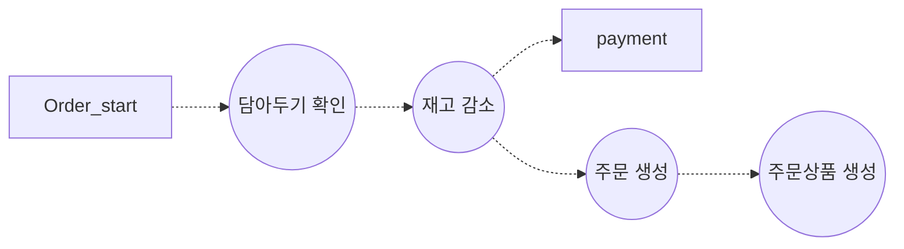

---
{"dg-publish":true,"permalink":"/Retrospect/0611~0706/0616 R.M으로 시작해서 MSA를 겉 배우게 되다./","noteIcon":"","created":"2025-06-20T21:45:38.002+09:00","updated":"2025-07-21T17:30:24.445+09:00"}
---

> RabbitMQ에서 시작된 내 MSA 고민기 

오늘은 너무 나도 분한 날이다.

크래프톤 정글 10기에 입소하기 전, 한 달도 채 안 되는 시간 동안 RabbitMQ를 공부하며 결제 시스템에 적용해보려 했다. RabbitMQ를 배우기로 결심한 이유는 단 하나, **더 세련된 구조의 코드를 작성하고 싶어서**였다.

이전 프로젝트들에서는 하나의 트랜잭션 안에 외부 API, DB 호출이 여러개 들어가 있는 경우가 많았다.
트랜잭션이 커질수록 결합도는 높아지고, 병목은 눈에 보이듯 예견됐다. 모듈을 분리하고, POJO 객체를 도입해도 궁극적으로는 '느슨한 결합'에 도달하지 못했다.
또한, **비동기 처리만으로는 결합도를 해결할 수 없다.**  
그렇다면, 어떻게 해야 진짜 객체지향적이고 느슨하게 연결된 구조를 만들 수 있을까?  
그 질문 끝에 도달한 개념이 바로 **이벤트 기반 아키텍처 (Event-Driven Architecture, EDA)** 였다.

Queue로 메시지를 주고받고, STOMP와 WebSocket을 활용해 간단한 채팅 서비스를 만들어보며 워밍업을 했다. 드디어 배운 것을 프로젝트에 적용해보려는 찰나, **첫 번째 벽**에 부딪혔다.

구현하려던 로직은 아래와 같다.

알림 로직도 중간중간 삽입해야 했고, 무엇보다 이제는 각 로직이 **개별 트랜잭션**으로 작동하게 되면서 **데이터 정합성과 원자성 보장**이 핵심 이슈로 떠올랐다.

예를 들어,
- 주문 생성이 실패했을 때 결제를 어떻게 롤백하지?  
- 재고 감소는 어떻게 되돌릴 수 있지?  
- 이미 결제가 완료된 상태라면?

게다가 오류가 발생했을 때 **DLQ, 재시도 처리, 상태 보상 로직까지 구현**해야 한다는 현실에 압도됐다. 머릿속은 복잡해졌고, **RabbitMQ 공부가 괜한 삽질은 아닐까?** 하는 두려움까지 들기 시작했다. MSA 개념이 자꾸 튀어나오는데, 나는 사실 MSA를 구현하려는 게 아니었기 때문이다.  
**목표는 단 하나, 단일 서버에서 '느슨한 결합'을 구현하는 것이었다.**

이런 막막함은 사실 처음이 아니다.  
첫 번째는 **DB를 처음 공부했을 때**, 두 번째는 **Spring Batch를 단기간에 익히려 했을 때**, 그리고 지금이 **세 번째**다.
이전보다 이번이 어려운 것은 모르겠다.하지만 시간이 부족하다는 압박감, 취업에 크게 도움이 되지 않는다는 현실을 느끼며 조금 더 어렵게 느껴졌다.

Saga 패턴도 공부해보고 간단한 구현도 해봤다.  
하지만 가장 어려운 지점은 여전히 '실패 이벤트 발생 시의 롤백 처리'였다.
예를 들어,  
- A 이벤트 → B, C 실행 → C 실패 → A, B 롤백  
- 이 시나리오에서 B가 아직 처리 중이면? DB에 반영이 안 됐다면?  
- **시간 차로 인해 발생하는 비일관성과 중복 처리** 문제는 해결이 쉽지 않다.

처음엔 '논리 삭제 후 5분마다 Batch 처리'를 고민했지만, 성능상 포기했다.  
Cascade 옵션이 안 통하는 테이블에서의 롤백, 이미 결제가 완료된 상태에서의 상태 복구 등은 여전히 불확실한 숙제다

원자성 VS 유연성 트레이드오프를 어떻게 해결할까?
아직 잘 모르겠다... 일단 내일 다시 생각해봐야지 