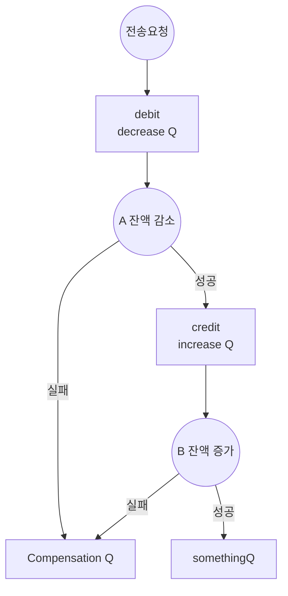

---
{"dg-publish":true,"permalink":"/retrospect/0617-r-m-saga-pattern-impl-feat-redis/","noteIcon":"","created":"2025-06-20T21:45:38.007+09:00","updated":"2025-07-13T21:29:38.621+09:00"}
---


> RabbitMQ에서 Saga-Pattern으로 보상 트랜잭션을 구현해보다 

--- 
최근 나는 RabbitMQ를 통해 Event-Driven-Architecture를 배우고 있었다.
이 기술을 배운 이유는 이전 [[Retrospect/0616 R.M으로 시작해서 MSA를 겉 배우게 되다.\|0616 R.M으로 시작해서 MSA를 겉 배우게 되다.]] 여기서도 언급했지만 긴 트랜잭션을 처리해야 할 때, 내 코드 로직을 좀 더 우아하게 만들어보고 싶었기 때문에 시작한 것이다.
그러다 0616 벽을 느꼈던 적이 있다. (자세한 내용은 이전 글)

아무튼 그 문제를 해결해보고자 Saga-Pattern을 공부하고 적용해보았다.
전체적인 Flow는 [[DevStudy/Backend/RM/saga/Code. Saga-Pattern\|Code. Saga-Pattern]] 여기 있다.
아래는 본 코드 들어가기 전에 연습할 flow  (하.... PC-laptop 움직이다가 오늘 정리한 내용들 다 지워졌어... flow 포함)


--- 
Event-Driven 아키텍쳐를 사용할 때 가장 큰 문제는 Atomicity였다. 
이 문제를 해결하는 방법을 여러 영상들, 글들을 찾아보고 GPT한테도 물어봤지만 이러한 아키텍쳐가 MSA에서 많이 쓰다보니 러닝커브가 높아보였다.
우연히 우한한테크? 유튜브에서 이러한 주제로 해결하는 영상이 있길래 감명 깊게 봤다. 내가 도입한 saga-pattern은 아니고 Outbox 패턴으로 msa에서 각 서버에서 공용으로 쓰는 DB에 상태들을 저장해서 뭐 데이터 유실을 막는다는데 이런 방법이면 앞서 말한 보상 트랜잭션도 막을 수 있는 것 같다.
하지만 나는 현재 MSA구조가 아니다. 이러한 점을 고려하면서 보상 트랜잭션을 구현하기 위한 전체적인 구상을 잡았다.
우선 보상 트랜잭션을 구현하는 방법의 version1을 구현해 보았다.
아래는 리팩토링 전 기본적인 보상 트랜잭션을 처리하는 핸들러이다.
```java 
@RabbitListener(queues = RabbitConfig.COMPENSATION_QUEUE)  
public void handleReceiveFail(CompensationRequest event) {  
  CompensationRequestType type = event.requestType();  
  
  switch (type) {  
    case ROLLBACK_TRANSFER -> log.info("transfer이 롤백 됩니다.");  
    case ROLLBACK_DEBIT -> customerService.addBalance(event.fromAccountId(), event.amount());  
    case ROLLBACK_CREDIT -> log.info("credit 처리를 롤백 합니다");  
    default -> throw new IllegalStateException("보상 타입을 찾을 수 없습니다");  
  }  
}
```
이러한 방법으로 각 event들은 예외가 터지면 관련 데이터를 그것을 위의 핸들러가 처리하는 queue에 적재하여 이 핸들러가 롤백을 처리하는 것이다. 아직 redis 도입 전이라 완벽하게 만들지는 않았지만 최종적으로 생각한 것은 아래와 같다.
 1. 각 event처리 handler는 공통의 tranferId를 갖는다.
 2. 첫 event가 시작하기 전 예상되는 각 event의 상태를 pending 상태로 만들어 놓은 DTO를 Redis에 저장한다.
 3. 각 event는 처리 시작 전 상태 확인?(하나라도 실패이면 진행 X) 
 4. 각 event는 실패 시 그 상태를 기록한다.
 5. 실패 event는 CompensationHandler의 queue로 간다.
 6. CompensationHandler는 transferId에 해당하는 Redis의 value값을 가져온다 ➡ 이 객체의 상태를 보고 롤백 시킨다. (각 event별 pending, success, failed 상태를 보고)

이전에 우아한 테크 유튜브에서 소개한 설계는 각 로직의 상태를 저장하고 파악할 때, 매번 DB를 사용했다. 
이러한 방식은 나의 방식과 적합하지 않다. 왜냐면 그들은 MSA환경에서 상태를 공유해야하고 나는 하나의 단일 서버에서 상태를 공유하는 것이기 때문이다. 이러한 점에서 인메모리 DB인 Redis를 사용한다면 성능면에서 더 좋지 않을까? 싶어서 Redis를 도입하며 리팩토링해보기로 했다.
MSA환경으로 확장이 된다면 Redis로 상태공유롤백 사용은 불가능이다. 그래도 지금 나에게 있는 환경에서 문제를 풀어보고자 Redis ㄱ (이전 코드 흐름 참고 : [[saga-pattern 코드 시작\|saga-pattern 코드 시작]]) 대략적인 활용 패턴은 다음과 같다.


--- 
*나의 문제점*

이번에 Event-Driven-Architecture를 공부하며 프로젝트에 도입할 때, 역시나 이전에도 발생했던 나의 문제점이 드러났다. 바로, 완벽히 설계하고 전부 이해하고 시작 하려는 것이다. 이는 부트캠프 강사님도 나에게 자주했던 말이다.
처음 이것을 도입할 때, 각 event를 비동기 처리하는데 각 event는 개별 트랜잭션 단위로 처리되다보니 어떻게 데이터의 정합성을 맞출까? 에 대해서 막막함을 느꼈다. 먼가 좀 더 세련되게 해보고 싶은데... 라는 생각으로 동기 방법의 EDA는 거들떠도 보지 않았다.
하지만, 그렇게 되다보니 막상 EDA도 익숙하지 않은데 너무 먼 미래만 보다보니 머리 속이 어지러워졌다.
먼가 최근 나에게 화났던게 이 때였다. 여기서 한계를 느끼고 막힌다면... 내가 이거밖에 안되나?라는 생각이 들었던 어제였다. 크래프톤 정글 입소까지 얼마 안 남은 시점에서 이러한 것들을 전부 이해할 수 있을까??? 어느 정도 내려놓고 동기식으로 event를 처리하는 방법과 saga-pattern으로 보상 트랜잭션도 구현해보았다.
근데 이렇게 하면서 RabbitMQ와 좀 더 친해지고 이 패턴에 대해서 익숙해지다보니 점점 초기에 구상했던 비동기 처리 로직 완성의 아이디어도 생기는 것 같다.
오늘로서 느낀다. 처음부터 완벽한 version은 없다. version을 천천히 늘려보는 습관을 가져보자 